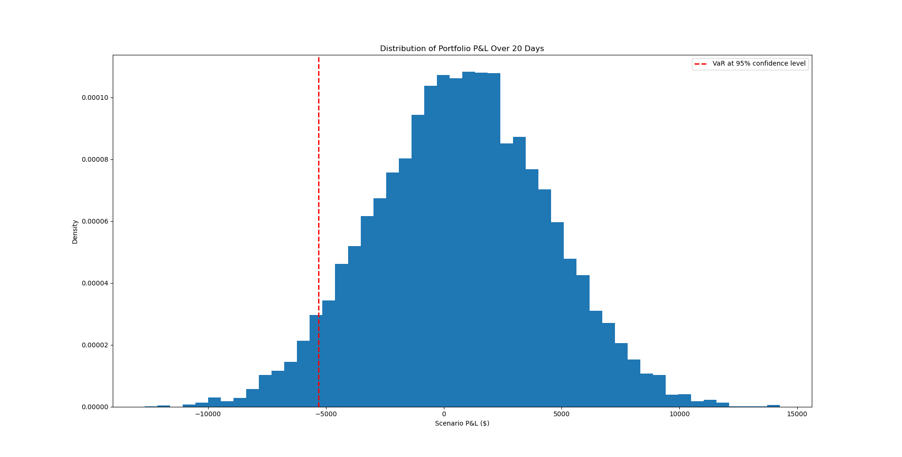
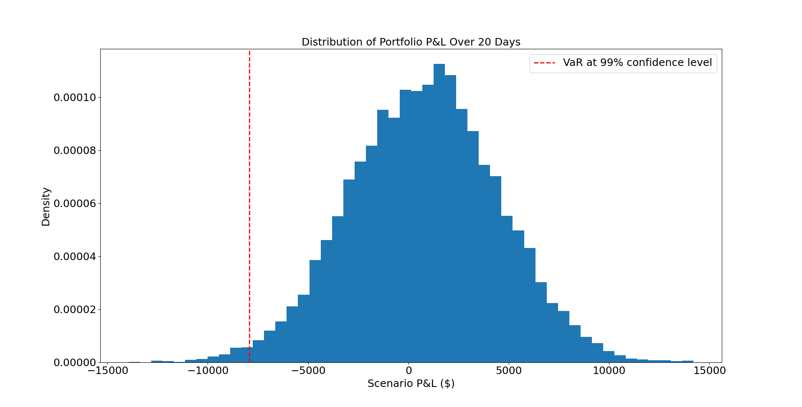

# Markets-and-Monte-Carlo-Simulations-

**VaR Model**
The future returns are based on historical returns. The portfolio consists of:
- SPY
- BND
- Largest commidity (GLD) 
- Largest NasDAQ (QQQ)
- (VTI)

The figures below show the simulated distribution of portfolio profit and loss over a 20-day horizon at a 95% and 99% confidence interval.

