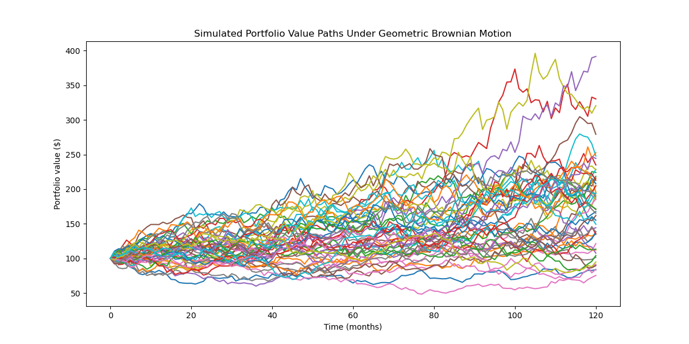
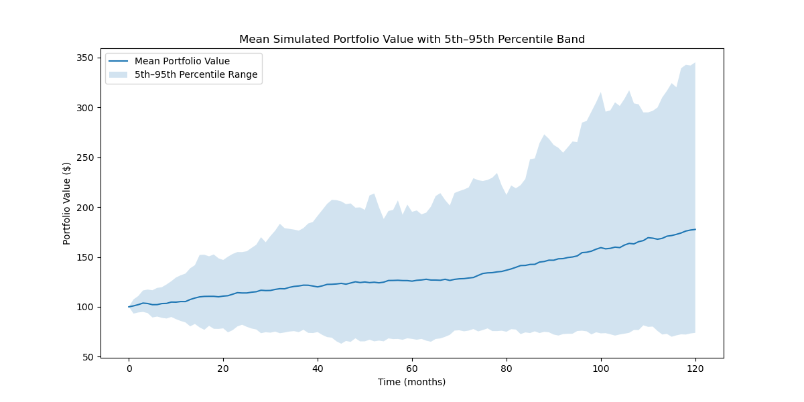

# Stochastic Modelling and Financial Models

**VaR_Monte_Carlo.py**

This file implements a Monte Carlo Value-at-Risk (VaR) model for a simple equally weighted portfolio. The portfolio consists of five exchange-traded funds (ETFs) stored in the tickers list:
- SPDR S&P 500 ETF Trust (SPY), 
- Vanguard Total Bond Market ETF (BND),
- SPDR Gold Shares (GLD),
- Invesco QQQ Trust (QQQ),
- Vanguard Total Stock Market ETF (VTI).

The model downloads historical price data, computes daily log returns and estimates the portfolio’s expected return and volatility using the historical covariance matrix. It then simulates possible future portfolio profit-and-loss outcomes over a 20-day holding period using normally distributed random shocks. The resulting histogram shows the distribution of simulated portfolio P&L. The red dashed vertical line represents the estimated VaR threshold. At the 95% confidence level, this is the loss level expected to be exceeded in only 5% of simulated scenarios. At the 99% confidence level, the VaR threshold moves further into the left tail, reflecting a more conservative estimate of downside risk. This provides a simple framework for estimating potential portfolio losses under historical volatility and normal return assumptions.

**Portfolio_Value_GBM.py**

This file simulates possible future portfolio value paths using a discrete-time approximation of geometric Brownian motion (GBM). At each time step, the portfolio value is updated according to

$$S_{t+\Delta t} = S_t R_t,$$

where

$$R_t \sim \mathcal{N}\left((1+\mu)^{\Delta t}, \sigma\sqrt{\Delta t}\right).$$

Here, $S_t$ is the portfolio value at time $t$, $\mu$ is the expected annual return, $\sigma$ is the annual volatility, $\Delta t$ is the time step size measured in years and $R_t$ is the random return multiplier at each time step.

The model generates multiple random walk trajectories over a fixed investment horizon, allowing us to visualise how a portfolio with initial value $S_0 = 100$ may evolve under assumed annual drift and volatility parameters.

